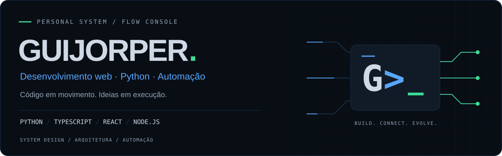
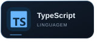
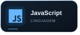
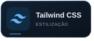
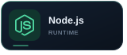
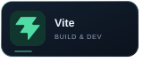
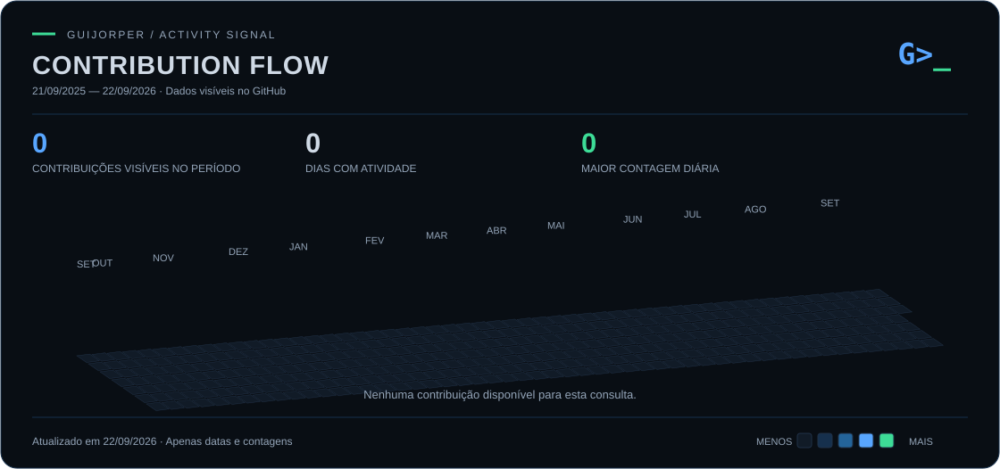

<p align="center">
  
</p>

<h1 align="center">Guijorper <code>G&gt;_</code></h1>

<p align="center">
  Desenvolvimento web · Python · Automação
  <br />
  <strong>Código em movimento. Ideias em execução.</strong>
</p>

<p align="center">
  <a href="https://github.com/GUIJORPER">
    
  </a>
</p>

<p align="center">
  <a href="#01--identity">IDENTIDADE</a> ·
  <a href="#02--tech_stack">STACK</a> ·
  <a href="#04--contribution_flow">CONTRIBUIÇÕES</a> ·
  <a href="#05--connect">CONTATO</a>
</p>

---

## 01 // IDENTITY

```python
developer = {
    "handle": "Guijorper",
    "focus": ["Desenvolvimento web", "Automação", "Ferramentas de TI"],
    "languages": ["Python", "TypeScript", "JavaScript", "C#"],
    "frontend": ["React", "Tailwind CSS"],
    "backend": ["Node.js", ".NET"],
    "studying": ["System Design", "Arquitetura de projetos"],
    "signature": "Código em movimento. Ideias em execução.",
}
```

**Em estudo:** System Design e arquitetura de projetos.

## 02 // TECH_STACK

Tecnologias presentes nos meus projetos, do código à execução.

**Front-end**

<p>
  
  
  
  
</p>

**Back-end & automação**

<p>
  
  
  
  
</p>

**Banco de dados**

<p>
  
  
  
</p>

**Ferramentas & qualidade**

<p>
  
  
  
  
</p>

**Infraestrutura**

<p>
  
</p>

## 03 // TERMINAL

```text
guijorper@flow-console:~$ boot --profile

[ OK ] Identidade carregada
[ OK ] Stack mapeada
[ OK ] Perfil pronto

PROFILE  : Guijorper
FOCUS    : Web / Automação / Ferramentas de TI
STACK    : Python / TypeScript / React / Node.js
STUDYING : System Design / Arquitetura de projetos

guijorper@flow-console:~$ next
> código em movimento_ █
```

## 04 // CONTRIBUTION_FLOW

**Minha atividade, dia a dia.**

<p align="center">
  
</p>

<sub>A altura e a cor de cada coluna representam a quantidade de contribuições no dia. Atualização diária, com os dados disponibilizados pelo GitHub.</sub>

[Ver calendário nativo de contribuições ↗](https://github.com/GUIJORPER?tab=overview)

## 05 // CONNECT

[](https://github.com/GUIJORPER)

---

<p align="center">
  <code>G&gt;_</code> <strong>GUIJORPER / FLOW CONSOLE</strong>
  <br />
  <sub>Código em movimento. Ideias em execução.</sub>
</p>
